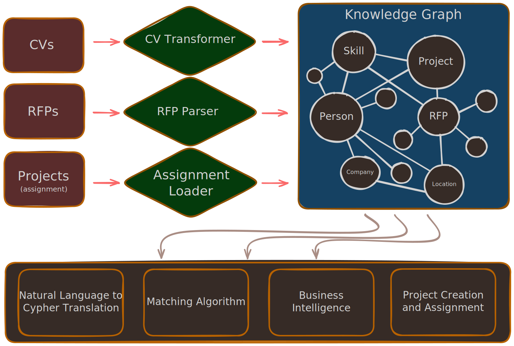

 # Staffing GraphRAG: AI-Powered Talent & Resource Orchestration

>From Unstructured Documents to Intelligent Staffing Decisions.

Staffing GraphRAG is a knowledge graph system that solves the complexity of resource
allocation in software development. By transforming static PDFs (CVs, RFPs) and
project definitions into a dynamic Neo4j Knowledge Graph, it enables semantic
search, natural language querying, and constraint-aware matching algorithms to find
the perfect developer for every project.

## System Architecture


### The Problem
Modern staffing is broken. It relies on:
  - Data siloed between different places and formats
  - Error-prone keyword matching
  - Manual availability checks
  - Meetings or message chains for getting any complex insight
  - Poor work reuse between people
  - Tribal knowledge

### The Solution
Staffing GraphRAG unifies this data into a Single Source of Truth — a Knowledge Graph.

1. Ingest: Agents read PDF CVs, RFPs, and initial project definitions, extracting
   entities and relationships.
2. Connect: Link people to skills, past and current projects, and many more. Same
   goes for RFPs.
3. Query: Ask natural questions like "Who has experience with React and is available
   next month?"
4. Match: Algorithmically rank candidates for new business proposals (RFPs) based on
   weighted skill scores and temporal constraints. Choose appropriate programmers and
   automatically convert RFPs into projects.

## Key Features
1. Automated Knowledge Extraction

Ingest resumes and Request for Proposal. The system automatically parses them, identifying:
  - Technical Skills & Proficiency Levels
  - Work History & Companies
  - Certifications & Education
  - Project Constraints (Budget, Deadline, Team Size)

2. Natural Language Graph Querying (GraphRAG)

Instead of needing to learn how to write complex Cypher queries, just ask:
>"How many senior Python developers do we have located in New York?"  
>"Show me everyone who worked at Google and knows Kubernetes."

3. Smart Matching Engine

The core value proposition. When an RFP comes in, the system doesn't just look for
keywords. It runs a multi-factor scoring algorithm:
  - Mandatory vs. Preferred: Mandatory skills carry higher weight (10x) than
    nice-to-haves.
  - Temporal Availability: It checks ASSIGNED_TO relationships. If a star developer
    is busy until May, and the RFP starts in June, the system identifies them as a
    "Future Match."
  - Missing Skills Analysis: Instantly identifies what skills the candidate lacks for
    a specific role.

4. Assignment Lifecycle Management

- RFP-to-Project Conversion: With one click, convert a proposal into an active
  project.
- Relationship Updates: Automatically creates ASSIGNED_TO edges, updating the
  availability of all selected staff in real-time.

## Relationships
The power lies in the relationships. Strict ontology ensures high-quality data
retrieval.

- Core Nodes: Person, Skill, Project, RFP, Company, University, Certification.
- Rich Relationships:
  - (Person)-[HAS_SKILL {level: "Expert"}]->(Skill)
  - (Project)-[REQUIRES {mandatory: true}]->(Skill)
  - (Person)-[ASSIGNED_TO {end_date: "2026-05-10"}]->(Project)

## Set up Locally
### Backend
1. Add the `OPENAI_API_KEY` key to the `backend/.env`.
2. Set up dependencies:
- If using nix:
  ```bash
  nix develop
  ```
- Otherwise enter the `backend` directory and run `uv sync`.
3. Start the database and wait a few seconds for it to initialize:
```bash
docker-compose up -d
```
4. Run the server:
```bash
uvicorn src.main:app --reload
```
### Client
1. Setup dependencies:
- If using nix:
  ```bash
  nix develop .#client
  ```
- Otherwise enter the `client` directory and run `uv sync`.
2. Launch it:
```bash
uv run streamlit run src/app.py
```
